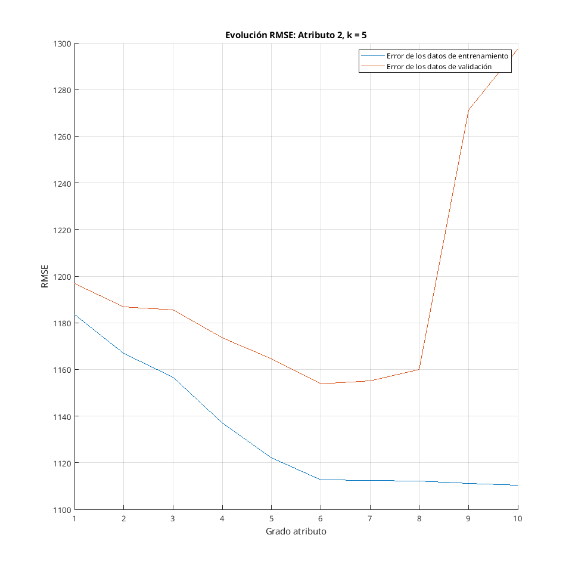
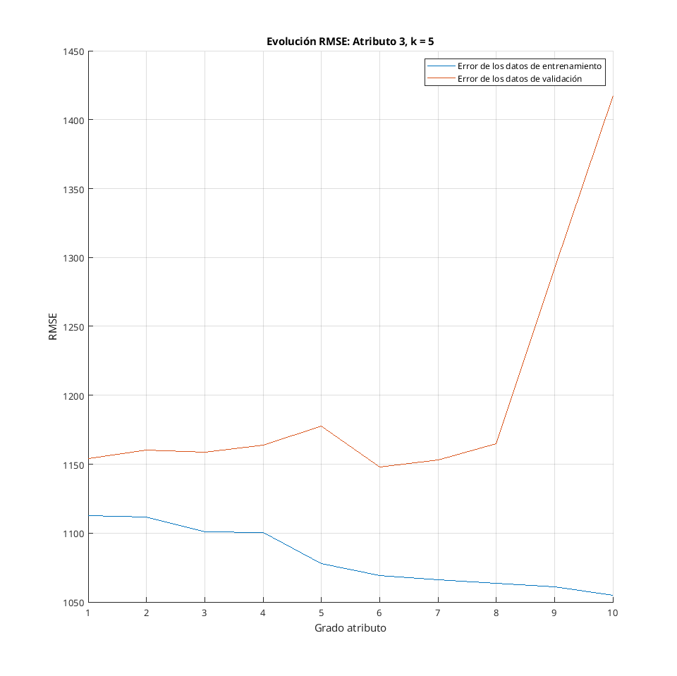

## Búsqueda heurística

En primer lugar, se ha probado obtener un modelo de regresión polinómica utilizando una búsqueda heurística y *k-fold cross validation*.

La búsqueda heurística es un tipo de algoritmo voraz. En este, se ajustan los grados de cada atributo del polinomio uno a uno, empezando con todos grados a 1. Una vez encontrado un valor adecuado para un atributo, se fija y procede al siguiente.

Se han probado modelos de grado 1 hasta 10 con un tamaño de partición de cada *k-fold* de 5. Las siguientes tablas muestran la evolución del RMSE a medida que avanza el algoritmo. Los errores representan el error en precio entre la predicción y los datos de test o validación.

RMSE de los datos de entrenamiento:

| Grado     | 1      | 2      | 3      | 4      | 5          | 6          | 7      | 8      | 9      | 10     |
| --------- | ------ | ------ | ------ | ------ | ---------- | ---------- | ------ | ------ | ------ | ------ |
| [i, 1, 1] | 1313.2 | 1200.6 | 1200.0 | 1187.8 | **1183.4** | 1183.0     | 1182.8 | 1182.1 | 1179.0 | 1177.7 |
| [5, i, 1] | 1183.4 | 1166.9 | 1156.7 | 1136.8 | 1122.0     | **1112.7** | 1112.4 | 1112.0 | 1111.1 | 1110.4 |
| [5, 6, i] | 1112.7 | 1111.8 | 1101.0 | 1100.5 | 1077.8     | **1069.4** | 1065.9 | 1063.3 | 1061.0 | 1055.0 |

RMSE de los datos de validación cruzada:

| Grado     | 1      | 2      | 3      | 4      | 5          | 6          | 7      | 8      | 9      | 10     |
| --------- | ------ | ------ | ------ | ------ | ---------- | ---------- | ------ | ------ | ------ | ------ |
| [i, 1, 1] | 1320.1 | 1206.4 | 1209.1 | 1200.5 | **1196.7** | 1200.1     | 1202.4 | 1203.9 | 1204.1 | 1204.5 |
| [5, i, 1] | 1196.7 | 1186.9 | 1185.6 | 1173.6 | 1164.7     | **1153.9** | 1155.0 | 1159.9 | 1271.3 | 1297.4 |
| [5, 6, i] | 1153.9 | 1160.0 | 1158.8 | 1163.7 | 1177.6     | **1147.8** | 1153.2 | 1165.0 | 1292.1 | 1417.6 |

![Evolución de errores para el atributo 1, k = 5. Se puede observar como para [1,1,1] y [2,1,1] se produce subajuste, y a partir de [6,1,1] comienza a producirse sobreajuste.](atrib1_heuri.png){ width=65% }

{ width=65% }

{ width=65% }

También se ha probado con un valor de k = 10, con poca diferencia y llegando a las mismas conclusiones. 5 y 10 suelen ser valores adecuados en la mayoría de los datos. Para reducir el número de iteraciones del *k-fold*, se ha escogido k=5.

RMSE de los datos de entrenamiento:

| Grado     | 1      | 2      | 3      | 4      | 5          | 6          | 7      | 8      | 9      | 10     |
| --------- | ------ | ------ | ------ | ------ | ---------- | ---------- | ------ | ------ | ------ | ------ |
| [i, 1, 1] | 1314.5 | 1201.9 | 1201.5 | 1189.5 | **1185.1** | 1184.9     | 1184.8 | 1184.2 | 1181.4 | 1180.3 |
| [5, i, 1] | 1185.1 | 1168.9 | 1159.2 | 1139.6 | 1125.1     | **1115.7** | 1115.3 | 1115.0 | 1114.6 | 1113.6 |
| [5, 6, i] | 1115.7 | 1115.2 | 1104.6 | 1104.4 | 1082.9     | **1073.5** | 1070.0 | 1068.2 | 1066.5 | 1058.8 |

RMSE de los datos de validación cruzada:

| Grado     | 1      | 2      | 3      | 4      | 5          | 6          | 7      | 8      | 9      | 10     |
| --------- | ------ | ------ | ------ | ------ | ---------- | ---------- | ------ | ------ | ------ | ------ |
| [i, 1, 1] | 1309.9 | 1198.0 | 1200.6 | 1192.4 | **1188.4** | 1191.5     | 1193.0 | 1194.1 | 1193.7 | 1193.7 |
| [5, i, 1] | 1188.4 | 1176.1 | 1171.4 | 1157.5 | 1147.5     | **1137.4** | 1139.8 | 1147.4 | 1210.6 | 1232.9 |
| [5, 6, i] | 1137.4 | 1143.3 | 1142.8 | 1147.1 | 1159.7     | **1134.3** | 1137.2 | 1155.4 | 1251.8 | 1692.9 |

Se ha probado también alterar el orden de los atributos. En este caso, los errores son los del entrenamiento final:

| Orden   | Modelo devuelto | Error *10³ (entrenamiento) | Error * 10³ (test) |
| ------- | --------------- | -------------------------- | ------------------ |
| 1, 2, 3 | [5, 6, 6]       | 1076.5                     | 1009.3             |
| 1, 3, 2 | [5, 6, 7]       | 1072.9                     | 1011.3             |
| 2, 1, 3 | [5, 6, 6]       | 1076.5                     | 1009.3             |
| 2, 3, 1 | [5, 6, 6]       | 1076.5                     | 1009.3             |
| 3, 1, 2 | [5, 6, 7]       | 1072.9                     | 1011.3             |
| 3, 2, 1 | [10, 6, 7]      | **1063.7**                 | **999.2**          |

Se puede apreciar que al cambiar el orden en el que se ajustan los grados, el algoritmo puede devolver resultados diferentes. Esto se debe a su condición de algoritmo voraz: a cambio de reducir las combinaciones a probar, se puede no llegar a una solución adecuada. Además. se puede apreciar en el último caso que el error al entrenar el modelo final es menor a los anteriores. Sin embargo, el mejor error obtenido durante el *k-fold* es de 1055.5
, mientras que el del caso original es de 1147.8, sugiriendo que se ha producido cierto sobreajuste.

También se ha probado realizar el *k-fold* con k igual al número de muestras. Sin embargo, esto aumenta significativamente el tiempo de ejecución, y devuelve el resultado sobreajustado obtenido antes.

## Búsqueda exhaustiva

La búsqueda exhaustiva consiste en explorar todas las combinaciones de modelos. A diferencia de la búsqueda heurística, si garantiza que se encontrará el mejor modelo en el rango de grados asignado. Sin embargo, esto resulta en que el tiempo de ejecución se dispara de 0.027 segundos a 1.025 segundos. Esto se debe a que, en el caso de k=5 y grados de 1 a 10, en la búsqueda heurística se exploran 30 combinaciones de modelos los cuales se entrenan cada uno 5 veces con particiones diferentes; aquí, se prueban 1000. 

| Mejor modelo obtenido | Error *10³ (entrenamiento) | Error * 10³ (test) |
| --------------------- | -------------------------- | ------------------ |
| [5, 6, 6]             | 1.0765                     | 1.0093             |

## Regularización

Finalmente, se ha aplicado regularización sobre un modelo de grado 10 para todos los atributos. El objetivo es reducir la complejidad de un modelo añadiendo un hiperparámetro $\lambda$ que sumado a la función de coste, esta aumente mas rápido a medida que la complejidad aumenta.

Se ha probado con 50 muestras distribuidas de forma logarítmica desde $10^{-9}$ hasta 10:

| $\lambda$     | Error (validación) | Error (test) |
| ------------- | ------------------ | ------------ |
| 1.000e-08     | 1.0613             | 1.2273       |
| 1.599e-08     | 1.0622             | 1.2136       |
| 2.559e-08     | 1.0630             | 1.1997       |
| 4.094e-08     | 1.0637             | 1.1874       |
| 6.551e-08     | 1.0643             | 1.1777       |
| 1.048e-07     | 1.0649             | 1.1713       |
| 1.676e-07     | 1.0655             | 1.1681       |
| **2.682e-07** | **1.0663**         | **1.1678**   |
| 4.291e-07     | 1.0676             | 1.1701       |
| 6.866e-07     | 1.0694             | 1.1743       |
| 1.098e-06     | 1.0717             | 1.1792       |
| 1.757e-06     | 1.0743             | 1.1840       |
| 2.811e-06     | 1.0768             | 1.1880       |
| 4.498e-06     | 1.0790             | 1.1910       |
| 7.196e-06     | 1.0807             | 1.1930       |
| 1.151e-05     | 1.0820             | 1.1940       |
| 1.842e-05     | 1.0829             | 1.1943       |
| 2.947e-05     | 1.0837             | 1.1938       |
| 4.714e-05     | 1.0844             | 1.1926       |
| 7.543e-05     | 1.0854             | 1.1911       |
| 0.000         | 1.0867             | 1.1894       |
| 0.000         | 1.0887             | 1.1880       |
| 0.000         | 1.0912             | 1.1871       |
| 0.000         | 1.0942             | 1.1868       |
| 0.000         | 1.0974             | 1.1869       |
| 0.001         | 1.1008             | 1.1875       |
| 0.002         | 1.1045             | 1.1886       |
| 0.003         | 1.1087             | 1.1905       |
| 0.005         | 1.1133             | 1.1935       |
| 0.008         | 1.1184             | 1.1975       |
| 0.013         | 1.1237             | 1.2022       |
| 0.021         | 1.1289             | 1.2068       |
| 0.033         | 1.1340             | 1.2107       |
| 0.054         | 1.1387             | 1.2138       |
| 0.086         | 1.1433             | 1.2162       |
| 0.138         | 1.1476             | 1.2180       |
| 0.222         | 1.1514             | 1.2191       |
| 0.355         | 1.1548             | 1.2195       |
| 0.568         | 1.1578             | 1.2191       |
| 0.910         | 1.1606             | 1.2182       |
| 1.456         | 1.1636             | 1.2170       |
| 2.329         | 1.1674             | 1.2163       |
| 3.727         | 1.1728             | 1.2172       |
| 5.963         | 1.1806             | 1.2208       |
| 9.540         | 1.1918             | 1.2284       |
| 15.264        | 1.2078             | 1.2415       |
| 24.420        | 1.2299             | 1.2610       |
| 39.069        | 1.2596             | 1.2880       |
| 62.505        | 1.2979             | 1.3234       |
| 100           | 1.3471             | 1.3690       |

{ width=65% }

A continuación, se muestra la evaluación del modelo entero: 

| $\lambda$ seleccionada | Error (entrenamiento) | Error (test) |
| ---------------------- | --------------------- | ------------ |
| 2.6827 * 10⁷           | 1073.3                | 1009.9       |

Los errores, comparados a los obtenidos con los métodos anteriores, son similares. Por otro lado, cabe destacar que ambos presentan errores medios altos, de unos 1000-1100 euros. En un rango de valores de 1400 a 16900 euros de los datos utilizados, esto es significativo. Habiendo agotado las técnicas presentadas en esta práctica, otras opciones para mejorar los resultados y reducir la complejidad son eliminar alguno de los atributos (con la pérdida de información potencialmente valiosa que conlleva) o añadir mas muestras de datos a los datos de entrenamiento. También se pueden añadir nuevos atributos, pero se deben depurar y deben ser significativos, puesto que cuantos mas atributos haya, mas complejo será el modelo de predicción. 