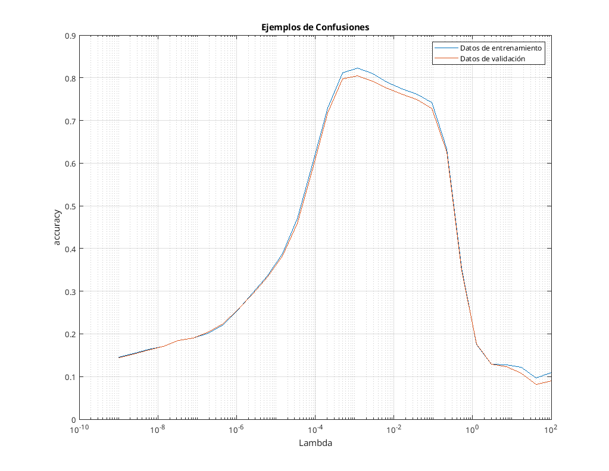
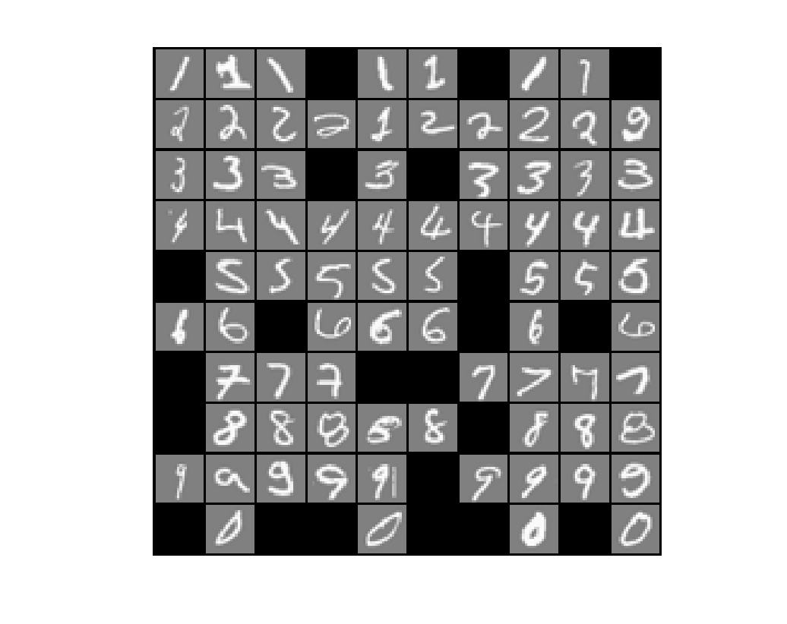
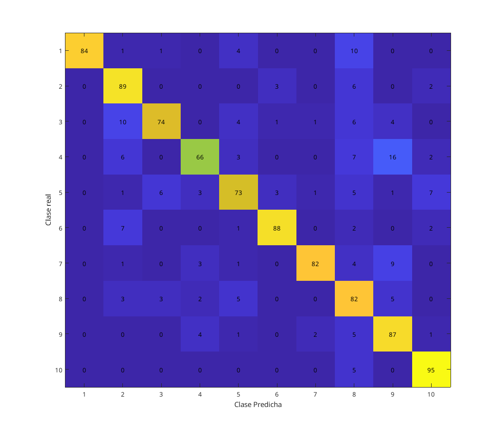
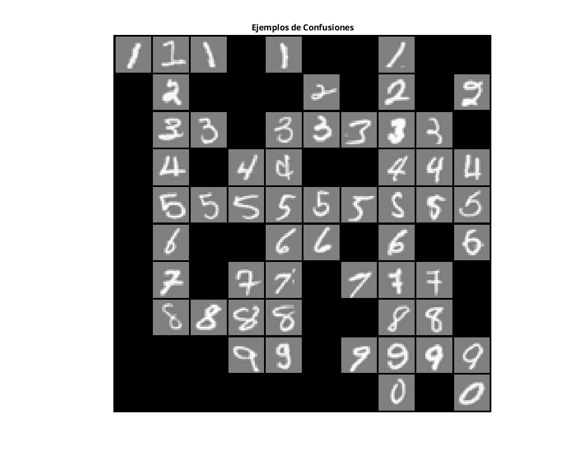
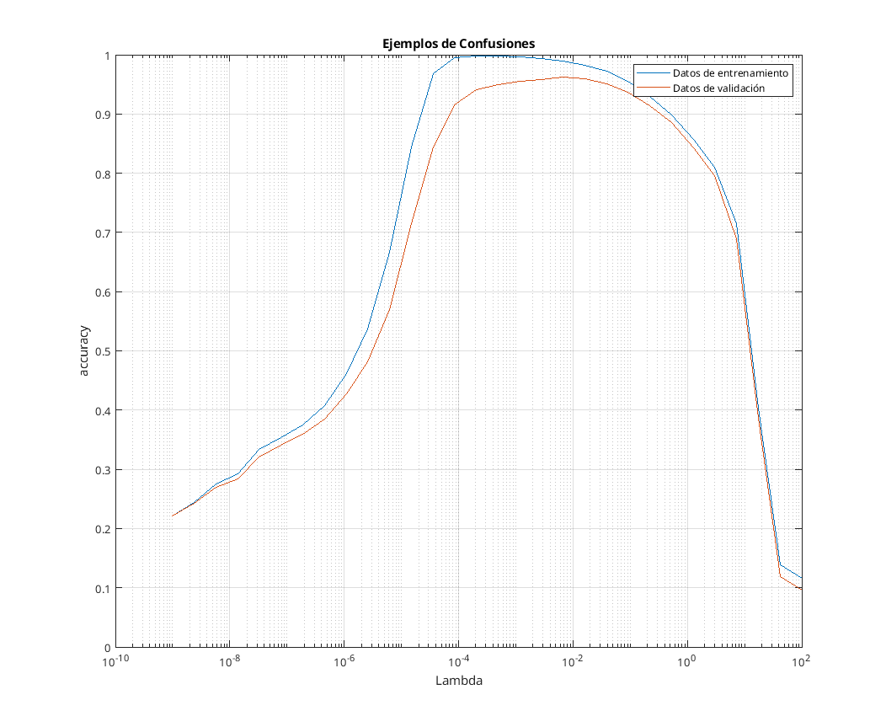
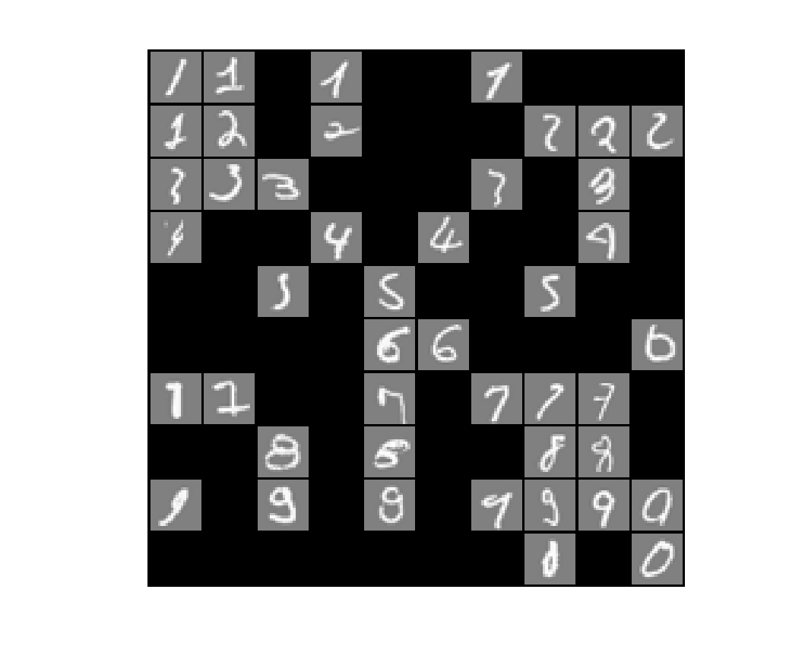
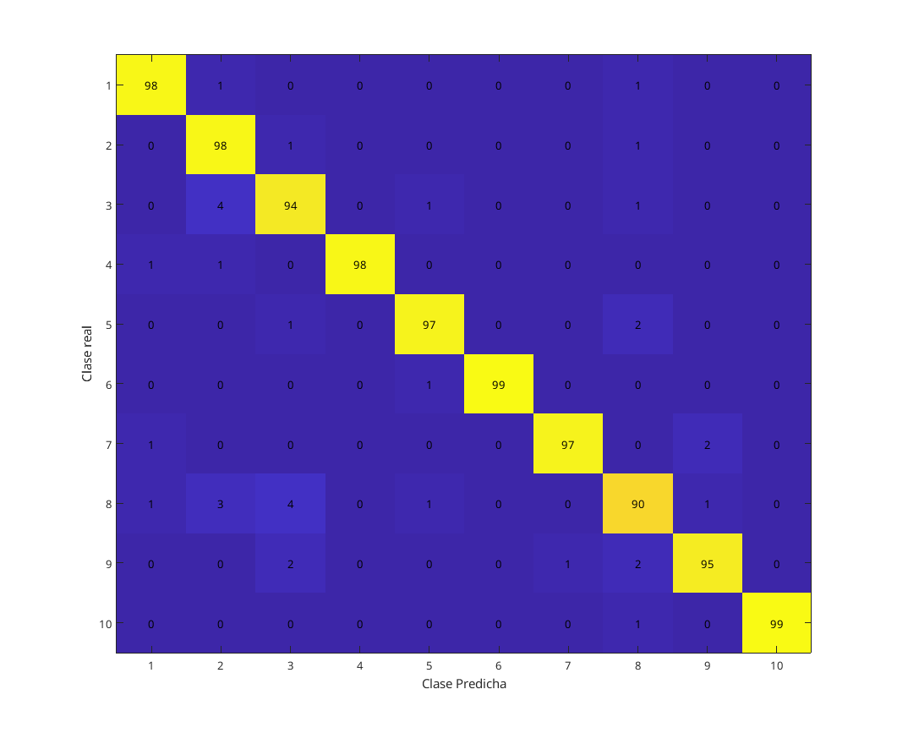
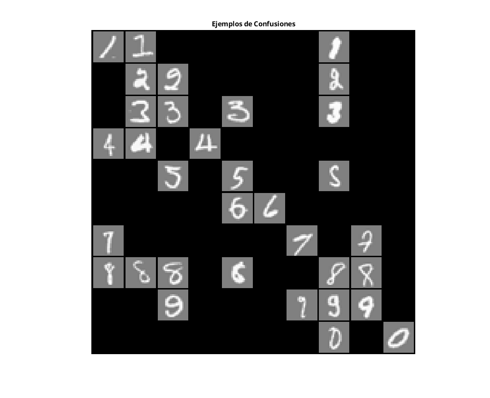
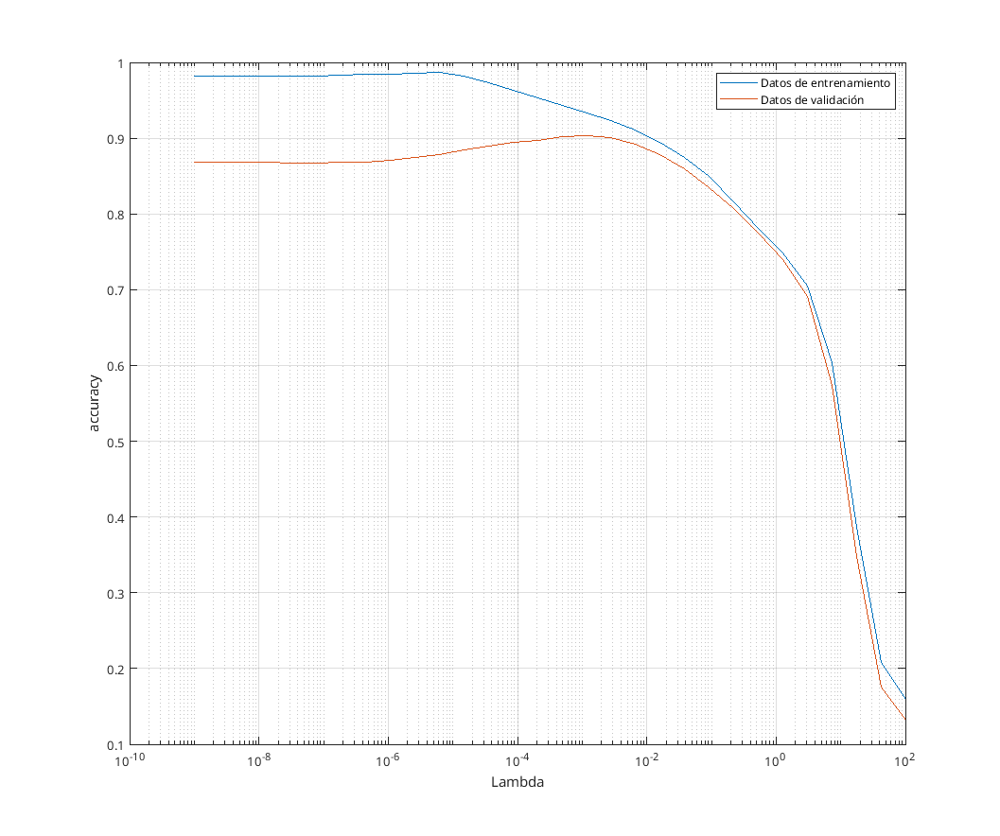
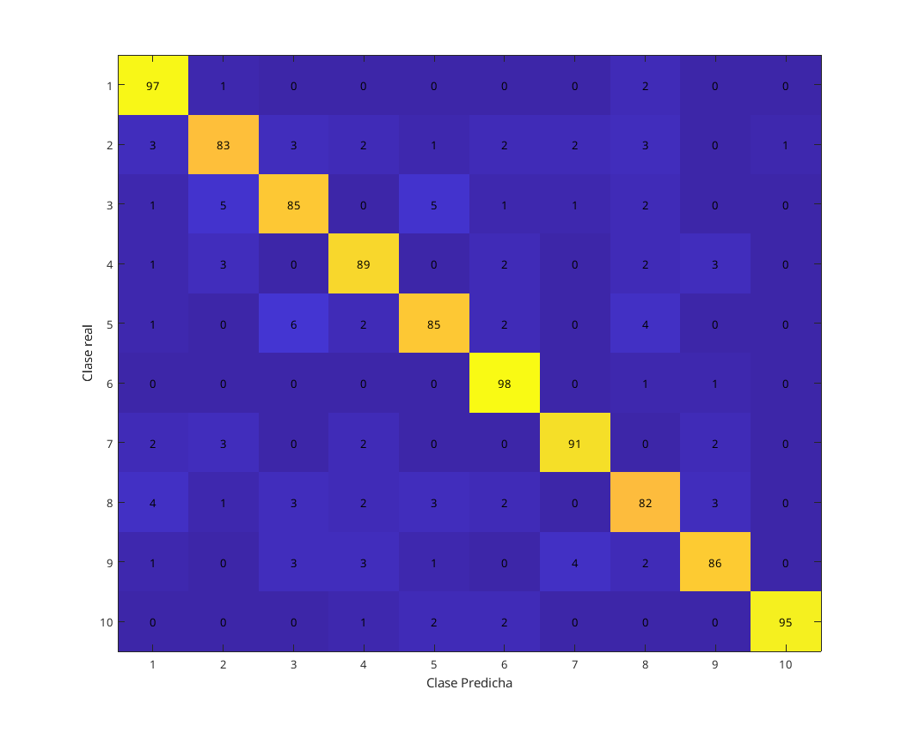

## Entrenamiento y clasificación con modelos gaussianos regularizados

Se han programado una serie de funciones que permiten obtener la distribución de los datos de entrenamiento, obtención de una predicción a partir de dicho modelo, así como un algoritmo k-fold para encontrar el mejor modelo.

Para obtener el mejor modelo, se utiliza el algotimo k-fold ya usado múltiples veces para ajustar el valor de la regularización.

```matlab
    % Para cada lambda
    for lambda = logspace(-9, 2, 30)
        accuracyTrain = 0; accuracyCV = 0;

        % Repite con 5 particiones
        for fold = 1:numParticiones
            [XCv, yCv, XTr, yTr] = particion(fold, numParticiones, X, y);

            % Obtiene un modelo gaussiano para cada clase 
            modelo = entrenarGaussianas(XTr, yTr, nc, naiveBayes, lambda);
            
            % Obtiene la predicción 
            yPred = clasificacionBayesiana(modelo, XTr);
            yPredCv  = clasificacionBayesiana(modelo, XCv);

            % Calcula métricas
            accuracyTrain = accuracyTrain + accuracy(yPred, yTr);
            accuracyCV = accuracyCV + accuracy(yPredCv, yCv);
        end

        % Calcula media de métricas
        accuracyTrain = accuracyTrain / numParticiones;
        accuracyCV = accuracyCV / numParticiones;

        trainHist = cat(1, trainHist, [lambda, accuracyTrain]);
        cvHist = cat(1, cvHist, [lambda, accuracyCV]);

        % Comprueba si el modelo es mejor
        if (accuracyCV > bestError)
            bestLambda = lambda;
            bestError = accuracyCV;
        end

    end
```

Para generar el modelo, se ha obtenido las distribuciones de cada una de las clases del conjunto de datos. Cada distribución queda descrita por la media de los atributos que pertenecen a la clase y su covarianza. En caso de utilizar Bayes ingenuo, se utiliza solamente la diagonal de cada covarianza. También se aplica un parámetro de regularización a la covarianza. Al haber muchas filas cuya covarianza (con $\lambda$ = 0) es cero (al haber píxeles que siempre tienen el mismo valor), intentar realizar la clasificación falla al no ser inversible. 

```matlab
for clase = 1:nc
    % Obtiene el número de muestras para la clase
    N_clase = sum(ytr(:,1) == clase);

    % Obtiene las muestras de la clase seleccionada
    XTr_clase = Xtr;
    XTr_clase(ytr(:,1) ~= clase ,:) = 0;

    % Media
    mu_clase = mean(XTr_clase, 2);

    % Covarianza
    Sigma_clase = cov(XTr_clase);

    if NaiveBayes 
        % Devuelve la covarianza diagonal si se usa Bayes ingenuo
        Sigma_clase = diag(diag(Sigma_clase));
    end

    % Aplica regularización al modelo
    Sigma_clase = Sigma_clase + landa * eye(size(Xtr, 2));

    % Guarda los datos
    modelo(clase).N = N_clase;
    modelo(clase).mu = mu_clase;
    modelo(clase).Sigma = Sigma_clase;
end
```
La clasificación se realiza obteniendo las predicciones para clase con los modelos obtenidos.

$\hat{y} = arg\space max_j (-\frac{1}{2} ln |\Sigma _j| - \frac{1}{2} (x-\mu _j)^T \Sigma ^-1 (x-\mu _j) + ln\space p(y_j))$

$d^2 = (x-\mu _j)^T \Sigma ^-1 (x-\mu _j) = z^Tz$ (dist. Mahalanobis)

$z = (R^T)^{-1}(x-\mu)$

$R = Chol(\Sigma)$

```matlab
nc = size(modelo, 2);
N = size(X, 1);

% Matriz de predicciones para cada atributo, para cada clase
p = zeros(size(X, 1), nc);

% Obtiene predicciones para cada clase
for i = 1:nc
    % Obtiene las probabilidades (convertidas a logaritmos) 
    pX_y = gaussLog(modelo(i).mu, modelo(i).Sigma, X);
    py = log(modelo(i).N / N);

    % Obtiene la predicción  
    p(:, i) = pX_y + py;
end

% Selecciona las clases con las mejores predicciones
[~, yhat] = max(p, [], 2);
```

## Bayes ingenuo

En primer lugar, se ha probado a realizar un entrenamiento y clasificación de los datos usando Bayes ingenuo. En el caso de Bayes ingenuo, se asume que los atributos son independientes el uno del otro.

- Mejor lambda: 0.0012
- Accuracy (train): 0.8220
- Accuracy (test): 0.8200

{ width=60% }

Se puede apreciar que la evolución de lambda es diferente respecto a la de la regularización de la regresión logística. No se observa el patrón de subajuste o sobreajuste visible en las regresiones. En este caso, se puede observar una "meseta" donde la precisión es relativamente alta, creciendo y decreciendo rápidamente en las zonas de sobreajuste y subajuste.


Se han obtenido las matrices de confusión para los datos de entrenamiento y de test, así como muestras con imágenes de dichas confusiones.

{ width=60% }

{ width=60% }

{ width=60% }

{ width=60% }

El 4 y el 9 son especialmente propensos a ser confudidos, con hasta 100 malas clasificaciones totales en los datos de prueba, y 20 en los de prueba.

Otros casos notables son el 1 y 5 con el 8, el 2 con el 3, el 3 con el 5 y el 7 con el 9.

## Covarianzas completas

Se ha realizado el mismo procedimiento descrito anteriormente, pero utilizando las covarianzas completas. Estas, a diferencia de Bayes ingenuo, si que tienen en cuenta las dependencias entre atributos.

- Mejor lambda: 0.0067
- Accuracy (train): 0.9858
- Accuracy (test): 0.9650


{ width=60% }


{ width=60% }

{ width=60% }

{ width=60% }

{ width=60% }

En este caso, es muy dificil discernir ningún patrón al clasificar los datos con tanta precisión.

## Comparación de modelos


| Modelo                | Accuracy (train) | Accuracy (test) | Tiempo entrenamiento |
| --------------------- | ---------------- | --------------- | -------------------- |
| Regresión logística   | 0.9303           | 0.8910          | 53.500764            |
| Bayes ingenuo         | 0.8220           | 0.8200          | 43.912181            |
| Covarianzas completas | 0.9858           | 0.9650          | 44.076047            |

Se destaca lo siguiente:

- Los datos parecen ser dependientes, con los malos resultados de la clasificación mediante Bayes ingenuo. 
- Los atributos parecen adaptarse a una distribución normal bien. En este caso, al tener 400 muestras de cada clase para el entrenamiento, se puede aproximar de forma segura a una distribución gaussiana incluso si la distribución no lo es realmente.
- Al ser un modelo generativo, y teniendo en cuenta los puntos anteriores, el modelo obtenido para el caso de la covarianza completa permite ser mas preciso con los mismos datos.
- El algoritmo entrena el modelo algo mas rápido que usando descenso de gradiente. En el caso de Bayes ingenuo, podría haber sido más rápido si se entrenase cada atributo de forma independiente, pues se evitaría calcular la inversa para la descomposición de Cholesky, una operación muy costosa. 


{ width=60% }

{ width=60% }

{ width=60% }

{ width=60% }

{ width=60% }
