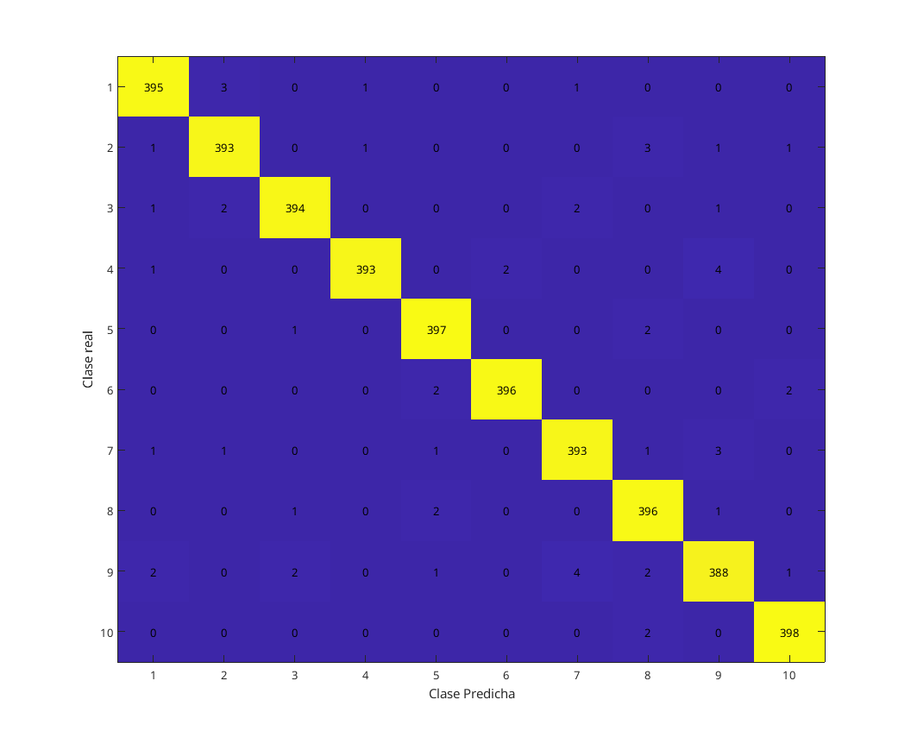
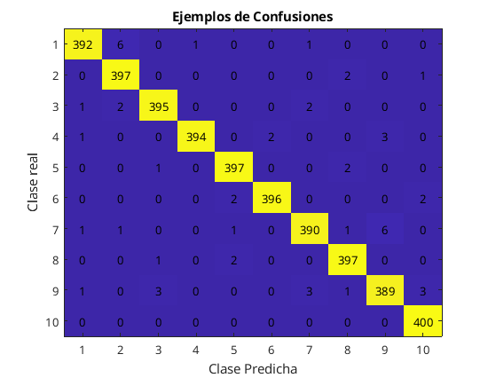
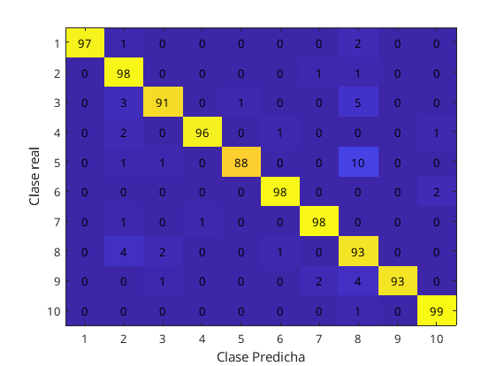
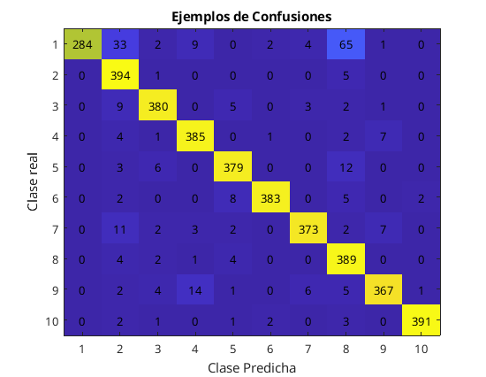
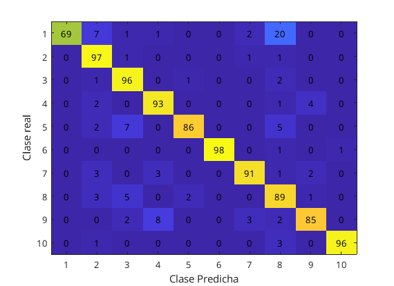
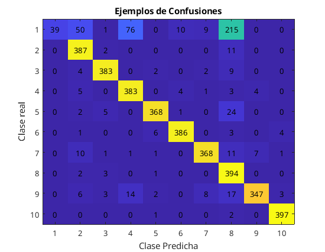
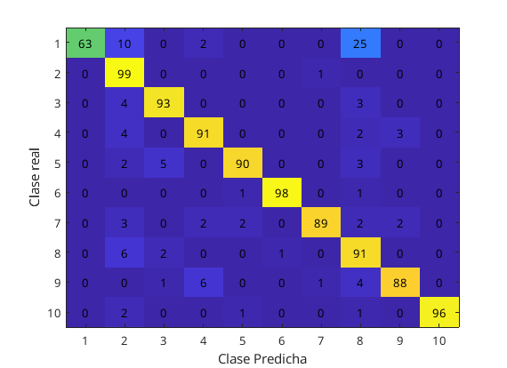

## 1. Reducción de la dimensión

### Apartado a

Se pueden eliminar al menos 5 atributos sin alterar de ninguna forma los resultados: los atributos 1, 2, 20, 381 y 400. Se puede comprobar en la matriz de covarianzas generada durante el PCA: las filas y columnas pertenecientes a estas componentes son 0, indicando que no varían en ningún momento respecto al resto de componentes. En este caso estos atributos tienen valor 0 (es decir, los píxeles que representan siempre tienen el mismo valor), pero el resultado sería el mismo para cualquier valor tal que sea constante para toda la columna de X.

### Apartado b

Al entrenar con el modelo producido por la reducción de dimensiones, se obtiene una precisión en el conjunto de test de 0.951, en comparación al 0.965 obtenido sin la reducción, ambos utilizando covarianzas completas. Además, el modelo parece tener dificultades en particular al clasificar el número 8.

Aun así, los resultados son bastante buenos teniendo en cuenta que manteniendo el 99% de la variabilidad se ha logrado reducir las componentes de 400 a 153, lo cual implica también tiempos de entrenamiento mucho mas reducidos.

## 2. Filtrado de ruido en imágenes

### Apartado b

Se ha aplicado el filtrado de ruido para las imágenes de la siguiente forma:

1. Se ha aplicado PCA sobre el conjunto de datos con ruido.
2. Para volver a obtener una imágen 20x20, se ha multiplicado la proyección por la traspuesta del vector propio 400xk obtenido al crear en conjunto anterior.

Al recuperar las imágenes y compararlas, se puede apreciar que, a medida que se va reduciendo el número de componentes principales tomadas, se reduce también el ruido producido. Por otro lado, conforme se reduce la dimensión el dígito se vuelve menos "nítido". Esto puede ser una ventaja, al estar mejor definidas las formas que deben tener los números, aunque también provoca que algunos números sean dificiles de clasificar incluso para el ojo humano.

### Apartado c

Al usar los clasificadores anteriores con imágenes a las que se les ha aplicado ruido, se puede apreciar una degradación de los resultados. En particular, ambos clasificadores tienen problemas al no conseguir distinguir el 1 del 8.

Esto se debe tanto por el ruido aplicado, que vuelve la clasificación mas ambígua, como por la pérdida de información en el caso de PCA.

## Resultados

| Modelo                                               | lambda | Accuracy (train) | Accuracy(test) |
| ---------------------------------------------------- | ------ | ---------------- | -------------- |
| P5                                                   | 0.0067 | 0.9858           | 0.9650         |
| P61 (k=153)                                          | 0.0072 | 0.9868           | 0.9510         |
| P62 (modelo P5, imágenes con ruido 0.3)              | 0.0072 | 0.9335           | 0.8930         |
| P62 (modelo P61, imágenes proyectadas con ruido 0.3) | 0.0072 | 0.8600           | 0.8840         |
| P62 (imágenes reconstruidas vs ruido, k=60)          | 0.0139 | 0.8640           | 0.7650         |
| P62 (imágenes reconstruidas vs ruido, k=100)         | 0.0139 | 0.9485           | 0.8450         |
| P62 (imágenes reconstruidas vs ruido, k=153)         | 0.0518 | 0.9708           | 0.8620         |
| P62 (imágenes reconstruidas vs ruido, k=250)         | 0.0518 | 0.9942           | 0.8590         |
| P62 (imágenes reconstruidas vs normal, k=153)        | 0.0518 | 0.9375           | 0.9210         |

{ width=60% }

{ width=60% }

{ width=60% }

{ width=60% }

{ width=60% }

{ width=60% }

{ width=60% }

{ width=60% }