## 1. Selección de método de inicialización

Se ha considerado una serie de formas de inicializar los centroides para los agrupamientos generados.

- Centroides puramente aleatorios en el rango [0, 255] distribuidos de forma uniforme.
- Centroides puramente aleatorios en el rango [0, 255] distribuidos de forma normal.
- Centroides obtenidos utilizando K muestras del conjunto de datos, permutados aleatoriamente.
- Centroides a partir de los datos, multiplicados por la función rand (dist. normal)

También se ha investigado otros métodos como *k-means++* o el *naive sharding*, pero no se han utilizado para esta práctica.

## 2. Selección del número de clústers adecuado

Para seleccionar el valor de K adecuado, se han probado valores de K desde el 1 hasta el 16, repitiendo el algoritmo K-medias 10 veces cada vez. Para determinar el mejor número de agrupaciones, se ha utilizado el método del codo, esto es, el valor a partir de del cual la reducción del error disminuye considerablemente.

Cuanto menor sea el número de agrupaciones, mayor será la pérdida de información al recuperar la imágen comprimida, pero también será menor el tiempo de ejecución. La diferencia entre imágenes reconstruidas disminuye conforne aumenta el número de agrupamientos, esto es, se nota mucho la diferencia entre K=4 y K=6, pero no tanto en entre K=16 y K=20, por ejemplo.

## 3. Imágenes adicionales

Junto con la imágen proporcionada para la práctica, se han añadido pruebas con otras dos imágenes adicionales. Estas son imágenes de prueba comunmente utilizadas.

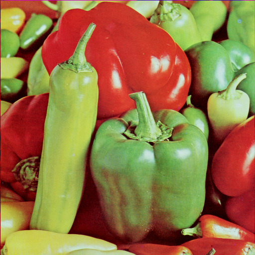{ width=25% }

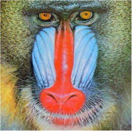{ width=25% }

## 4. Resultados

### Loro

| K   | Mejor distorsión (J) | Tº medio(aleatorios uniformes) | "(aleatorios normales) | " (conj. datos) | " (datos * rand()) |
| --- | -------------------- | ------------------------------ | ---------------------- | --------------- | ------------------ |
| 1   | 51.0611              | 0.0035                         | 0.0038                 | 0.0028          | 0.0029             |
| 2   | 50.2808              | 0.0453                         | 0.0382                 | 0.0578          | 0.0392             |
| 3   | 50.2056              | 0.0686                         | 0.0818                 | 0.0927          | 0.0917             |
| 4   | 48.1464              | 0.0991                         | 0.3879                 | 0.3626          | 0.4363             |
| 5   | 47.5337              | 0.1858                         | 0.3205                 | 0.3343          | 0.2945             |
| 6   | **45.7541**          | 0.5054                         | 0.3113                 | 0.3532          | 0.3999             |
| 7   | 45.8492              | 0.5188                         | 0.5142                 | 0.4270          | 0.4409             |
| 8   | 45.7885              | 0.7104                         | 0.4886                 | 0.4517          | 0.3805             |
| 9   | 45.6331              | 0.6053                         | 0.4567                 | 0.4637          | 0.4376             |
| 10  | 45.6795              | 0.5280                         | 0.5345                 | 0.5161          | 0.5435             |
| 11  | 45.3309              | 0.5175                         | 0.6297                 | 0.5250          | 0.5878             |
| 12  | 45.4327              | 0.6586                         | 0.5439                 | 0.5713          | 0.7732             |
| 13  | 45.4587              | 0.6850                         | 0.8027                 | 0.6988          | 0.9005             |
| 14  | 45.2920              | 0.7888                         | 0.8647                 | 0.9007          | 0.8790             |
| 15  | 45.1473              | 0.7765                         | 1.0565                 | 0.9418          | 0.9816             |
| 16  | 45.2049              | 0.9937                         | 0.9185                 | 0.8292          | 1.0259             |

#### Evolución de J según el método de inicialización (en órden)

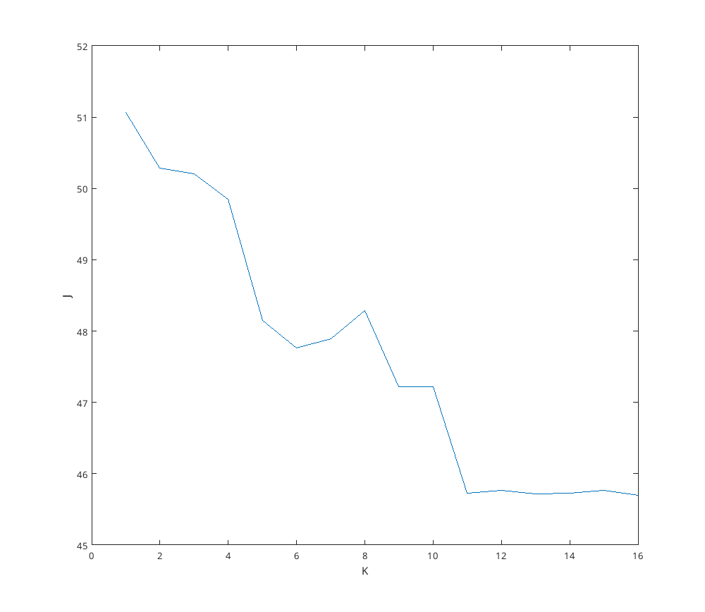{ width=50% }\ 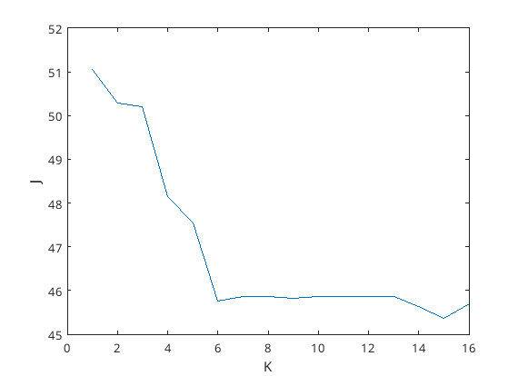{ width=50% }

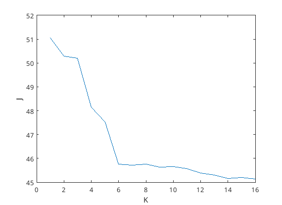{ width=50% }\ 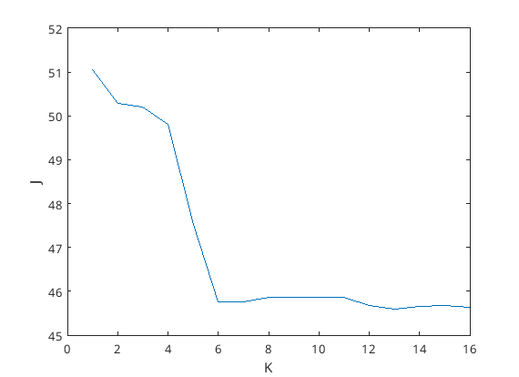{ width=50% }

#### Resultados con K=2, 6, 16, 32

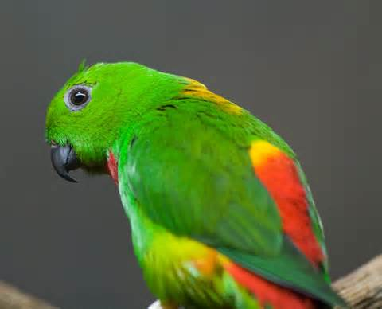{ width=50% }

{ width=50% }\ 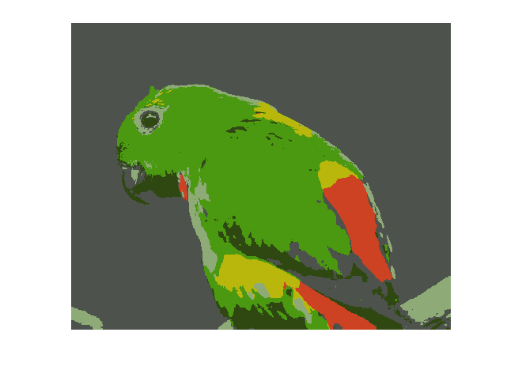{ width=50% }

{ width=50% }\ 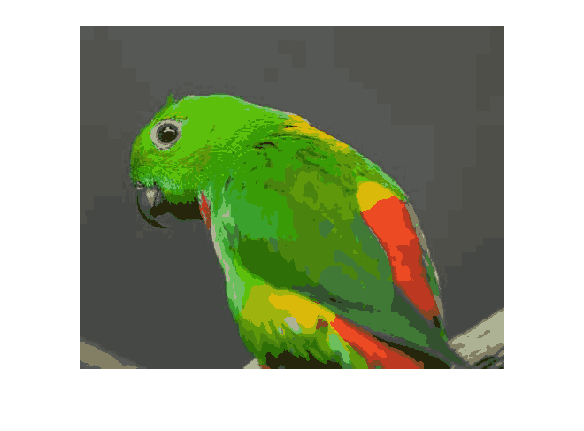{ width=50% }

### Pimientos

| K   | Mejor distorsión (J) | Tº medio |
| --- | -------------------- | -------- |
| 1   | 123.1150             | 0.0050   |
| 2   | 120.6413             | 0.0430   |
| 3   | 115.8820             | 0.1957   |
| 4   | 113.4937             | 0.2012   |
| 5   | 111.9692             | 0.3241   |
| 6   | **111.4598**         | 0.5644   |
| 7   | 111.4921             | 0.6483   |
| 8   | 111.2646             | 0.9675   |
| 9   | 111.0457             | 1.3155   |
| 10  | 111.0829             | 1.3631   |
| 11  | 110.8231             | 1.6389   |
| 12  | 110.6396             | 1.4996   |
| 13  | 110.6029             | 1.7696   |
| 14  | 110.9690             | 2.0580   |
| 15  | 110.9363             | 2.0873   |
| 16  | 110.9657             | 6.6652   |

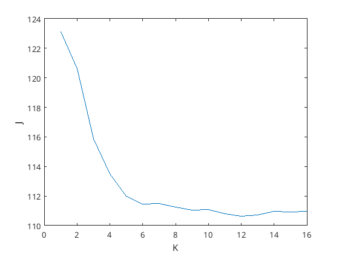{ width=50% }

#### Original vs K=6 vs K=16

{ width=50% }

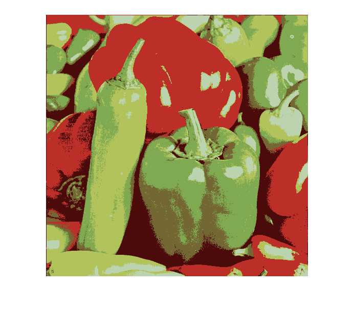{ width=50% }\ 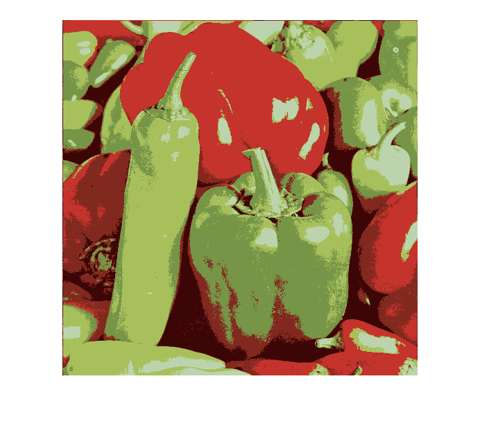{ width=50% }

### Mandril

| K   | Mejor distorsión (J) | Tº medio |
| --- | -------------------- | -------- |
| 1   | 85.9205              | 0.0013   |
| 2   | 71.5790              | 0.0201   |
| 3   | 75.7478              | 0.0310   |
| 4   | 71.3045              | 0.0875   |
| 5   | 70.3245              | 0.0791   |
| 6   | **68.5557**          | 0.1816   |
| 7   | 69.7799              | 0.1489   |
| 8   | 68.8520              | 0.1809   |
| 9   | 68.9025              | 0.2461   |
| 10  | 68.3107              | 0.3212   |
| 11  | 68.5170              | 0.3661   |
| 12  | 67.8754              | 0.3977   |
| 13  | 67.9075              | 0.4394   |
| 14  | 68.0156              | 0.4876   |
| 15  | 68.1478              | 0.4763   |
| 16  | 67.7985              | 0.5447   |
	
	
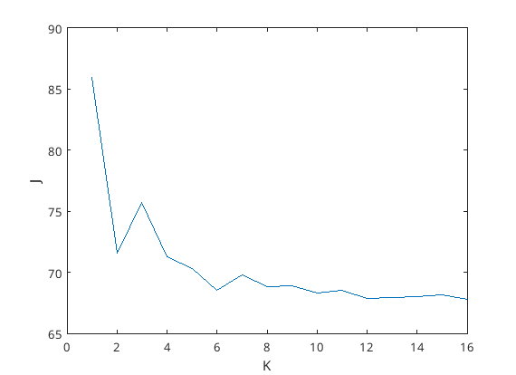{ width=50% }
	
#### Original vs K=6 vs K=16

{ width=50% }

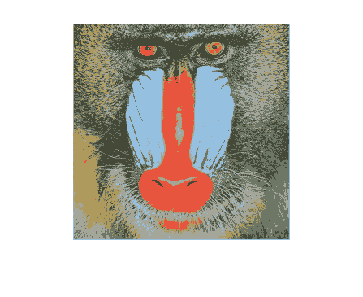{ width=50% }\ 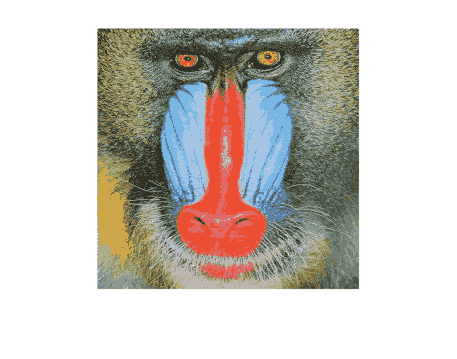{ width=50% }