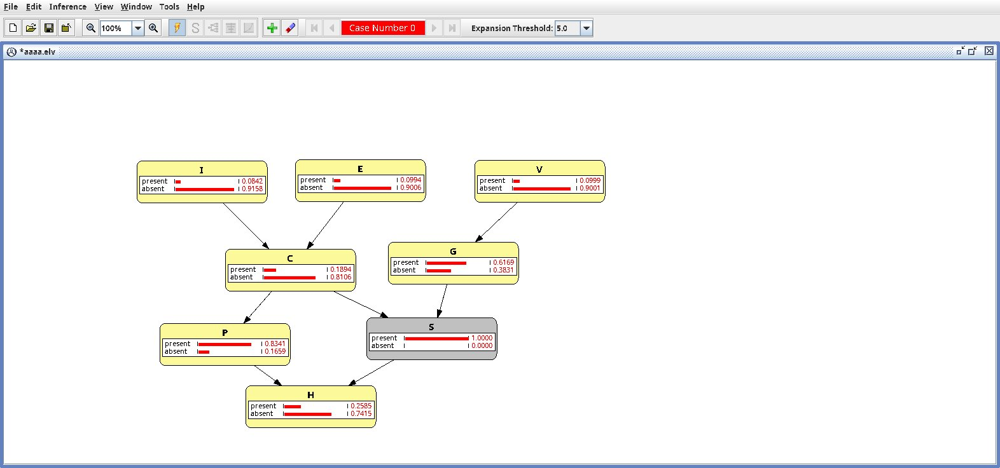

### Estudio previo

#### Apartado 1

#### Apartado 2

### Trabajo en OpenMarkov

#### Apartado 1

Para poder probar los resultados del primer apartado, se ha creado en OpenMarkov una red bayesiana como la que se ha dado en el enunciado. 

##### Subapartado a)

Se ha comprobado que en ambos casos dados, las variables no son independientes dado S. Para ello, se ha observado, utilizando el modo Inferencia, que marcando S como presente e intentando modificar alguna de las dos variables, la otra también cambia (aunque sea poco).

##### Subapartado b)

Similar al primer apartado, se han dado las variables dadas y se ha comprobado la probabilidad de la variable C.

#### Apartado 2

##### Subapartado a)

Se ha seguido las indicaciones del guión para generar la red.

##### Subapartado b)

Se ha utliizado la herramienta Inferencia para calcular las probabilidades.

##### Subapartado c)

El resultado (hay menos mujeres admitidas) no tiene que significar necesariamente que existe discriminación de género. Los pequeños tamaños muestrales para las mujeres que han intentado entrar en las carreras A y B pueden estar distorsionando las probabilidades reales de admisión. 