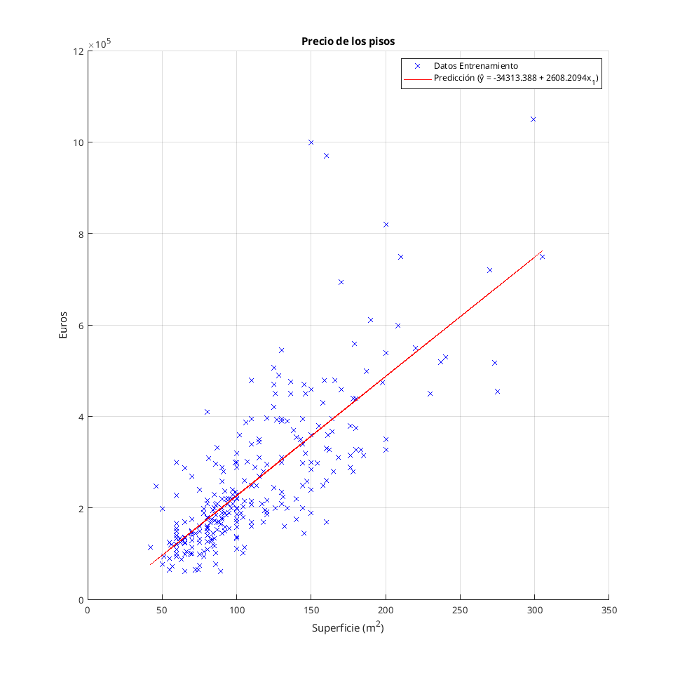
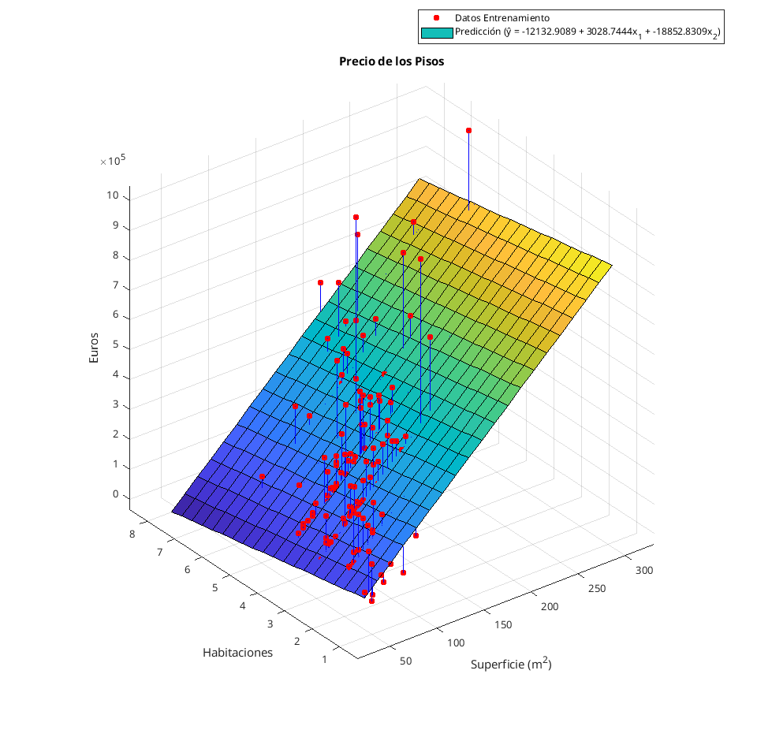
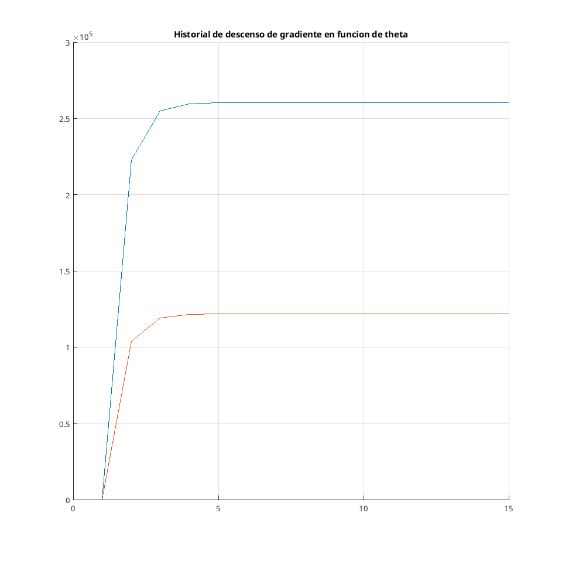
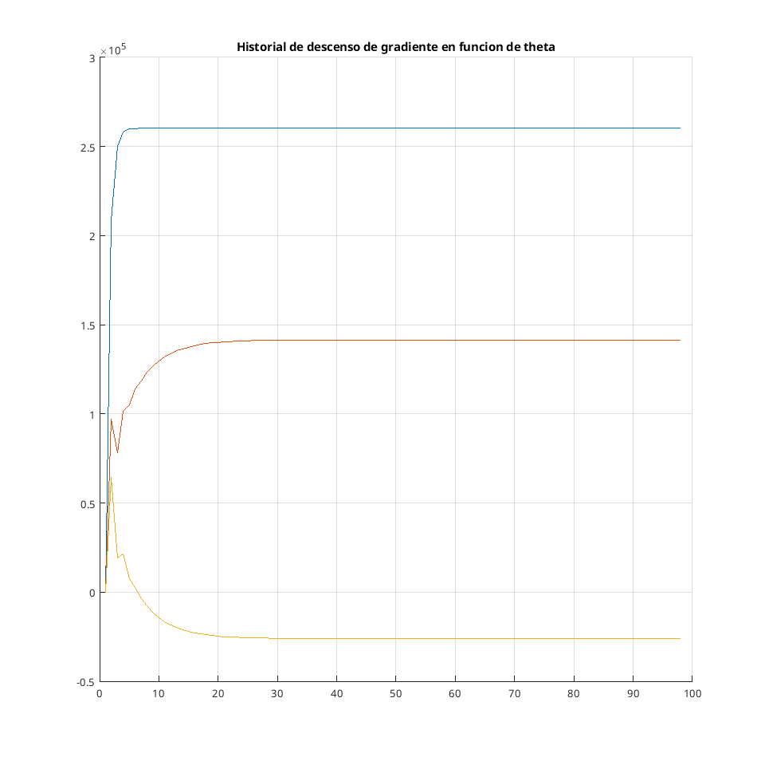
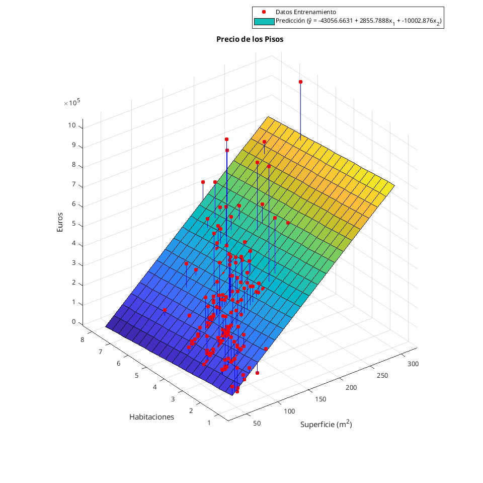
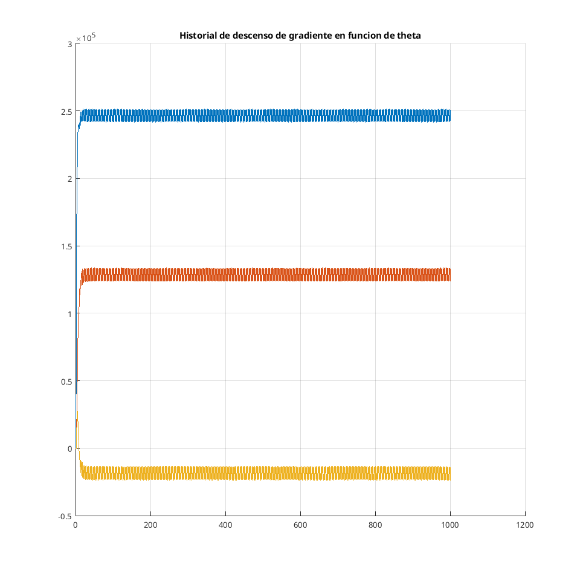

# Predicción de resultados y métricas de error

Los pesos utilizados para estimar la regresión adecuada para cada apartado se obtiene de una de las dos formas:

- Utilizando una solución analítica como la **ecuación normal**, que resuelve directamente el problema. El tiempo de ejecución aumenta cúbicamente respecto a las dimensiones de la matriz de atributos (empeora rápidamente con conjuntos de entrenamiento grandes)
- Utilizando el algoritmo de **descenso de gradiente**, el cual busca minimizar la función de coste de forma iterativa a partir de unos pesos iniciales, restando a estos el gradiente (primera derivada de la función). Su coste, y si converge, dependen de un factor de aprendizaje $\alpha$ y el número de iteraciones realizadas. Se entiende que converge cuando el gradiente se aproxima a 0 o lo es.

```matlab
% Ecuación normal
theta = X \ y;

% Algoritmo de descenso de gradiente
function [theta, thetaHist, i] = descensoCuadratico(X, Y, alpha)

    iter = 10 ^ 3; tol = 10 ^ -3;

    % Se inicializan los pesos de forma aleatoria
    theta = rand(size(X, 2), 1);

    for i = 1:iter
        % Calcula el gradiente dados los pesos
        grad = % Derivada función coste%

        % Para si el gradiente aumenta o si el cambio es pequeño
        if (i ~= 1)
            %if (gradPrevio > grad)
            %    break;
            %end
            if (abs(gradPrevio - grad) < tol)
                break;
            end

        end

        % Actualiza pesos restandole el gradiente
        theta = theta - alpha * grad;
        gradPrevio = grad;
    end

end

% Una vez sacados los pesos, ŷ se obtiene multiplicándolos con los atributos
yPred = X * theta;
```

Para evaluar lo adecuado que es el modelo, se utiliza como métrica el **error medio relativo** (MRE):

- El conjunto de datos no tiene muchos datos espurios, por lo que no se considera necesario utilizar la mediana, que ignora la mitad de los datos espurios.
- Es mas fácil interpretar porcentajes que el valor absoluto del error. 


```matlab
% Error medio relativo
error = mean(abs(precioPredicho - precio) ./ precio);
```

# Regresión monovariable, ecuación normal

Lo único que cabe destacar de las regresiones resueltas con la ecuación normal es que no es necesario normalizar los atributos.

{ width=75% }

```
Elapsed time is 0.000077 seconds.

error =

    0.3009
```

# Regresión multivariable, ecuación normal


{ width=75% }

```
Elapsed time is 0.000087 seconds.

error =

    0.2980
```

# Regresión monovariable, descenso de gradiente usando suma de errores cuadráticos

En este caso si es recomendable normalizar los atributos, pues ayuda a converger mas rápidamente en caso de que los rangos de valores que puedan adquirir cada categoría de atributos sean muy diferentes (la superficie tiene un rango de valores mucho mas grande que las habitaciones que tiene cada vivienda).

```matlab
% Normalización
mu = mean(X(:, 2:end));
sigma = std(X(:, 2:end));

XNorm = X;
XNorm(:, 2:end) = (X(:, 2:end) - repmat(mu, N, 1)) ./ repmat(sigma, N, 1);

% Desnormalización
theta(2:end) = theta(2:end) ./ sigma';
theta(1) = theta(1) - (mu * theta(2:end));
```

Para obtener el valor adecuado de $\alpha$ se han realizado los siguientes pasos:

1. Se ha empezado con una $\alpha$ arbitraria (p. e. 1).
2. Las primeras ejecuciones del algoritmo se realizan modificando el valor a mano, comprobando si se reduce el error o no.
3. Cuando el error vuelve a aumentar:
   1. Se crea un bucle que itere sobre un rango reducido de $\alpha$
   2. En un vector se almacenan la mejor pareja $\alpha$-error, iniciando con un error arbitrariamente alto.
   3. Por cada iteración del bucle, si el error mejora respecto al almacenado, se guardan los datos obtenidos.
   4. Se repite hasta obtener un parámetro con la precisión deseada.

{ width=75% }

{ width=75% }

```
Elapsed time is 0.001366 seconds.

alpha =

    0.0031


iter =

    15


error =

    0.3009
```

# Regresión multivariable, descenso de gradiente usando suma de errores cuadráticos 

{ style="width: 75% ; text-align: center" }

{ width=75% }

```
Elapsed time is 0.001127 seconds.

alpha =

    0.0029


iter =

    98


error =

    0.2980
```

# Regresión multivariable, descenso de gradiente usando función de coste de Huber

{ width=75% }

{ width=75% }

```
Elapsed time is 0.013137 seconds.

alpha =

    1.3500


delta =

  214.4000


iter =

        1000


error =

    0.2724
```

# Conclusiones

- El algoritmo de descenso de gradiente tarda mas en encontrar una solución adecuada que resolverlo con la ecuación normal. Esto se puede arreglar aumentando el cambio mínimo admisible entre iteraciones del algoritmo. También cabe destacar que el conjunto de datos es pequeño, y que la ecuación normal empeora cuando se tratan conjuntos grandes.
- Los dos métodos devuelven errores similares una vez ajustados.
- La regresión robusta obtiene un error mas pequeño. Esto se debe a que la función de coste de Huber es mucho menos sensible a datos espurios que la de coste cuadrático.
- La $\theta$ cuando se realiza el descenso de gradiente con el coste de Huber parece "oscilar" en torno al valor que tomaría con la funcíón de coste