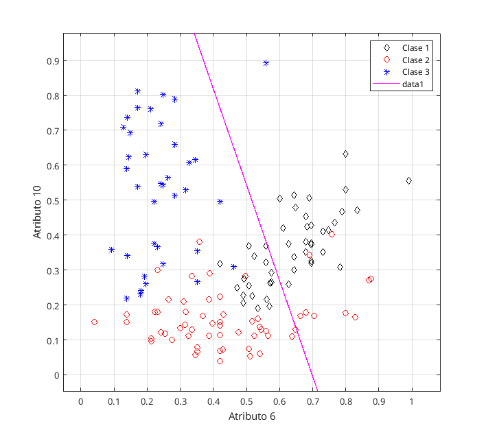
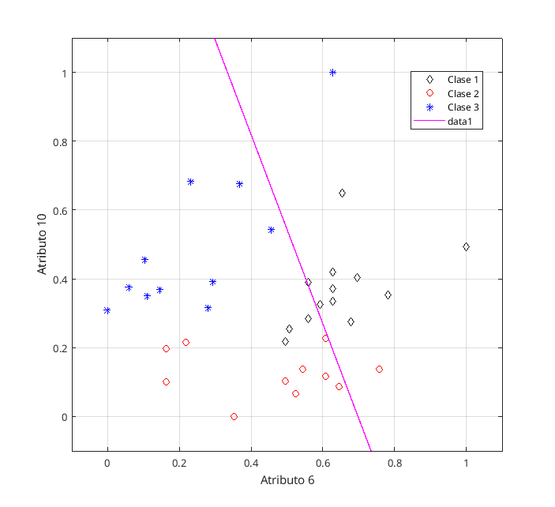
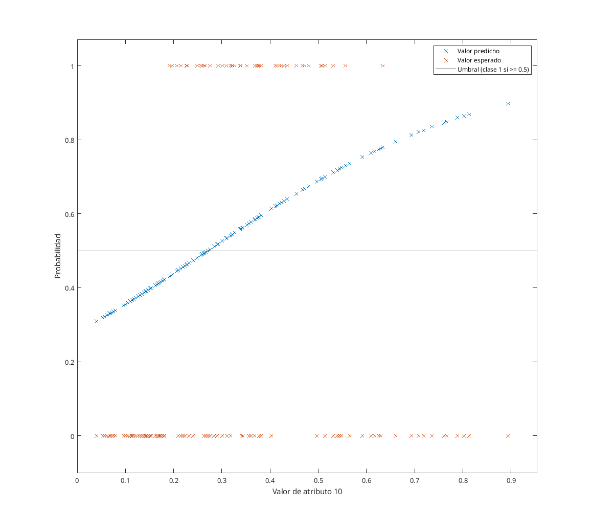
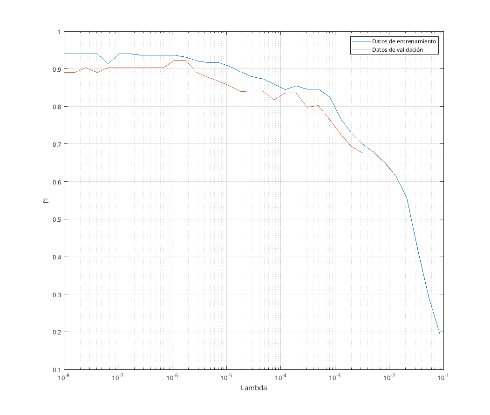
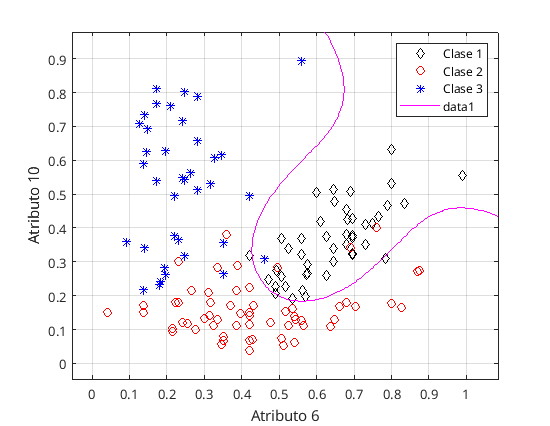
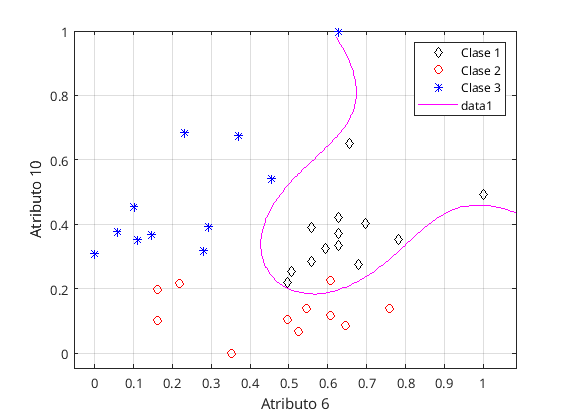
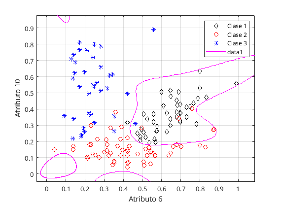
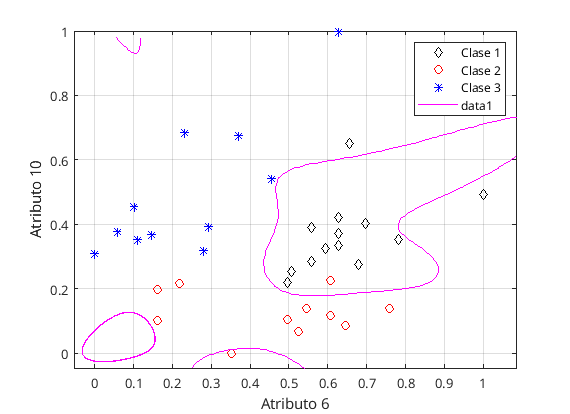
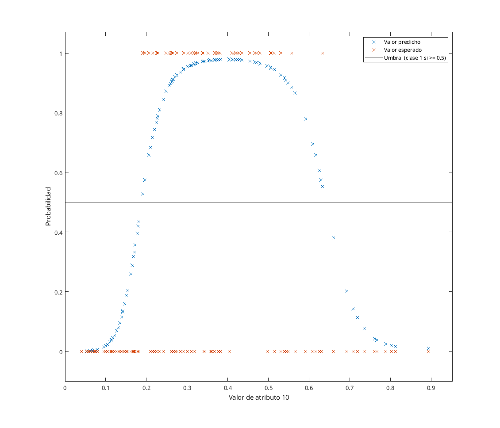
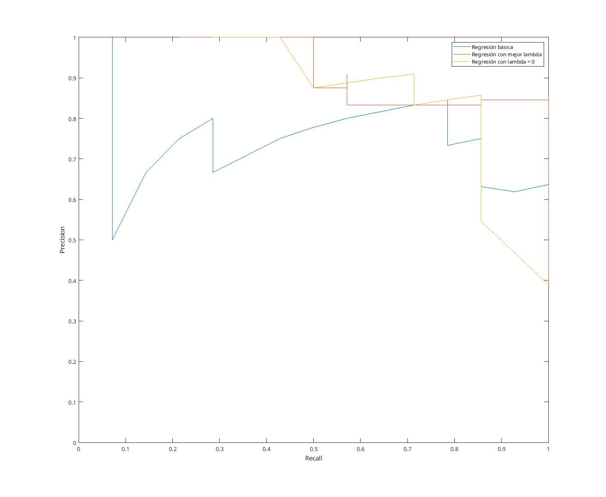

## Regresión logística básica

En primer lugar, se ha entrenado un modelo de regresión logística con el objetivo de clasificar una serie de vinos que pertenecen a tres grupos. Se quiere realizar una clasificación binaria de vinos son de clase 1 con los atributos 6 y 10.

Para obtener los pesos adecuados, se utiliza en esta práctica la función `minfunc` proporcionada, con el método de optimización de Newton que utiliza el gradiente y hessiano analiticos (1ª y 2ª derivada) para encontrar un mínimo global de la función de coste; en este caso, la de máxima verosimilitud. 

{ width=65% }

{ width=65% }

Se puede observar en las curvas que la regresión obtenida no se ajusta muy bien a los datos al aplicar un modelo lineal para la regresión.

En cuanto a las métricas, en el caso de clasificación binaria estas dependen de si la predicción coincide o no con el resultado esperado. Normalmente los resultados se pueden agrupar en una matriz de confusión según si son verdaderos positivos, verdaderos negativos, falsos positivos o falsos negativos. 

- ***Accuracy***: Procentaje de datos clasificados correctamente. Si los datos estan equilibrados (es decir, no hay una clase de datos con gran sesgo), es una métrica adecuada. En este caso, hay 45 datos de clase 1, 60 de clase 2 y 37 de clase 3. Pero en caso contrario, esta métrica podría ser engañosa, y el modelo no ser mejor que asumir que todos los datos son del mismo tipo.
- ***Precision***: Procentaje de positivos correctos de los clasificados como tal. ($\frac{TP}{ TP + FP }$).
- ***Recall***: Procentaje de los positivos clasificados que son correctos. ($\frac{TP}{ TP + FN }$).

También existe el ***f1-score***, que se calcula a partir de las dos últimas métricas ($2*\frac{P*R}{ P + R }$), pero se utiliza mas para seleccionar modelos, lo cual se hace más adelante.

| Datos         | Accuracy | Precision | Recall |
| ------------- | -------- | --------- | ------ |
| Entrenamiento | 0.8099   | 0.7368    | 0.6222 |
| Prueba        | 0.8611   | 0.8462    | 0.7857 |

En este caso se puede apreciar que el modelo suele acertar un 80% de las veces, pero suele equivocarse clasificando positivos como negativos, o viceversa.

En conclusión, se puede observar un claro subajuste con este modelo básico, por lo que se requiere buscar un modelo que mejor se ajuste a los datos.

Finalmente, se ha calculado la probabilidad de que un dato con el atributo 6 igual a 0.6 sea o no clasificado como clase 1 según su atributo 10.

{ width=65% }

Como se puede observar, los valores entre 0.3 y 0.5 suelen ser de clase 1. Sin embargo, la probabilidad de que se clasifiquen los datos no sigue a los datos. Se puede apreciar que muchos de las datos por encima de 0.5 los clasificaría erróneamente.

## Regularización

En la siguiente parte, se entrena un modelo de grado 6 para ambos atributos utilizando el algoritmo *k-fold*, con 5 particiones, para obtener la mejor lambda que devuelva una regresión logística que se ajuste mejor a los datos de entrenamiento y prueba. Para clasificar los mejores modelos, se ha utilizado la métrica *f1*, tal que los mejores modelos tienen el mayor valor.

Estos son los resultados obtenidos:

- Mejor $\lambda$: 1.098e-06
- Mejor *f1*:  0.9224

{ width=65% }

{ width=65% }

{ width=65% }

Con las gráficas, se puede observar como la regresión obtenida se ajusta mucho mejor a los datos, con precisión de hasta 95%. Aunque a veces genera falsos positivos, rara vez se encuentran falsos negativos, y con los datos de test se puede ver que clasifica correctamente todos los datos de clase 1 (hay que tener en cuenta que el conjunto de entrenamiento y validación son reducidos).

| Datos         | Accuracy | Precision | Recall |
| ------------- | -------- | --------- | ------ |
| Entrenamiento | 0.9577   | 0.9149    | 0.9556 |
| Prueba        | 0.9444   | 0.8750    | 1      |

Por otro lado, se ha probado encontrar un modelo con $\lambda$ = 0:

{ width=65% }

{ width=65% }

| Datos         | Accuracy | Precision | Recall |
| ------------- | -------- | --------- | ------ |
| Entrenamiento | 0.9577   | 0.9149    | 0.9556 |
| Prueba        | 0.8611   | 0.8462    | 0.7857 |

En este caso, se puede comprobar que, al ser $\lambda$ mayor, el modelo resultante acaba produciendo un mayor sobreajuste en comparación al modelo anterior.

{ width=65% }

En cuanto a la probabilidad descrita en el primer apartado, ahora la curva de probabilidad se ajusta mucho mejor a los datos esperados, prediciendo correctamente más datos del conjunto.

## Curvas precision/recall

Finalmente, se ha creado una serie de curvas *precision-recall* para cada uno de los tres modelos obtenidos. Dicha curva consiste en el valor de dichas métricas modificando el umbral en el que se considera un dato de una clase o de otra. Estas curvas se acercarán mas a la esquina superior derecha conforme sean mejores (donde su *precision* y *recall* sean perfectos).

{ width=65% }

Se puede observar que el peor modelo observado es el de regresión básica. En cuanto a las regresiones con regularización, el reducido número de datos de test dificulta el análisis al variar bastante sus valores entre pasos de la curva, pero se puede concluir que el mejor de los modelos es el de regresión con la lambda obtenida con el k-fold, al ajustarse mas a los márgenes y estar mas cerca de la esquina donde *precision* y *recall* son 1.

Sin modificar el conjunto de datos, para obtener un modelo con una precisión mayor (de mas de 90%), tal que el 90% de los vinos clasificados como 1 lo sean realmente, se puede sustituir la métrica *f1* por *f-beta* ($(1+ \beta^2)*\frac{P*R}{ P + R }$), donde se puede ajustar $\beta$ para dar mas importancia a la precisión ($\beta = \frac{1}{2}$) o al *recall* ($\beta = 2$). 