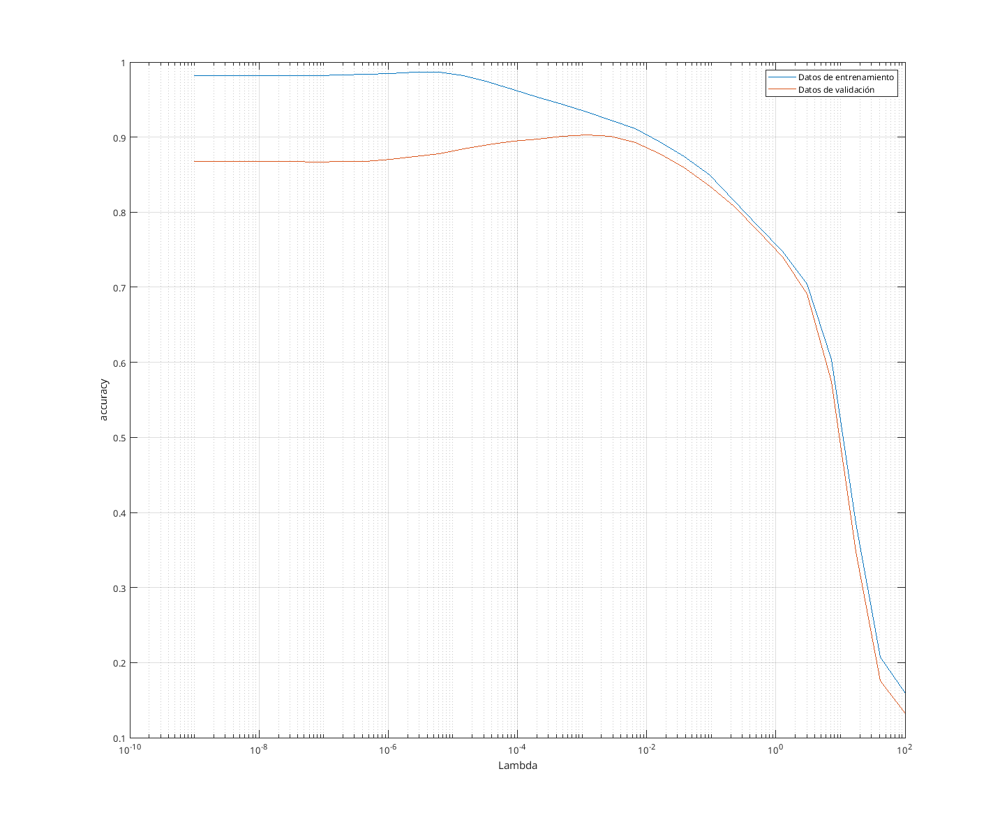
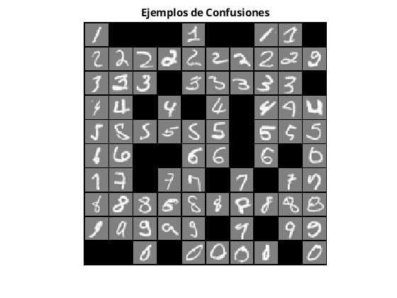
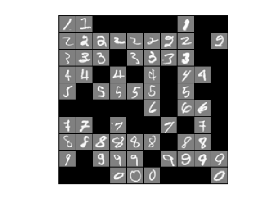
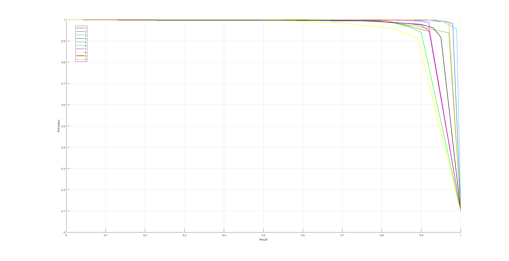

## Algoritmo de entrenamiento multiclase

Se ha adaptado el algoritmo *k-fold* de la práctica anterior para realizar un entrenamiento multiclase *one-vs-rest*, que consiste en entrenar modelos de regresión multiclase binaria para cada una clase (Dígitos 1 contra el resto, 2 contra el resto,...).

```matlab
% Repite con 5 particiones
for fold = 1:numParticiones
    [XCv, yCv, XTr, yTr] = particion(fold, numParticiones, X, y);

    Theta = zeros(size(XTr, 2), 10);

    % Obtiene un modelo para cada clase (one-vs-rest)
    for C = 1:10
        % Etiqueta soluciones para el caso
        yTr_c = yTr;
        yTr_c(yTr_c ~= C) = 0;
        yTr_c(yTr_c == C) = 1;

        theta0 = zeros(size(XTr, 2), 1);

        % Calcula pesos
        theta = minFunc(@CosteLogReg, theta0, options, XTr, yTr_c, lambda);
        Theta(:, C) = theta;
    end

    h = 1 ./ (1 + exp(- (XTr * Theta)));
    hCv = 1 ./ (1 + exp(- (XCv * Theta)));

    % Obtiene la mejor predicción por cada fila y su columna
    [~, yPred] = max(h, [], 2);
    [~, yPredCv] = max(hCv, [], 2);

    % Calcula métricas
    accuracyTrain = accuracyTrain + accuracy(yPred, yTr);
    accuracyCV = accuracyCV + accuracy(yPredCv, yCv);
end
```

Los pesos obtenidos para cada modelo se combinan en una matriz de pesos, con los que se obtienen las probabilidades de entrenamiento y validación cruzada para cada tipo de clase. De dichas probabilidades se obtiene las predicciones seleccionando la clase con la probabilidad mas alta de serlo.

Este proceso se ha repetido para una serie de valores *lambda*.

## Entrenamiento de una regresión logística regularizada multiclase

Se han probado una serie de 30 *lambdas* distribuidas de forma logarítmica entre $10^{-9}$ y $100$ con el algoritmo descrito anteriormente. 

Como métrica para evaluar, se ha utilizado el *accuracy* del modelo generado. Esto se debe a dos razones:

- Las muestras de entrenamientos están equilibradas: hay 400 casos de cada dígito del conjunto. Por tanto, podría ser una métrica válida.
- Es fácil de obtener: consiste en obtener el porcentaje de verdaderos positivos respecto al total de predicciones. En compararción, para utilizar el *f1-score* es necesario usar el promedio de cada clase.

{ width=100% }

| Lambda      | Accuracy (train) | Accuracy (CV) |
| ----------- | ---------------- | ------------- |
| 1.000e-09   | 0.982            | 0.867         |
| 2.395e-09   | 0.981            | 0.867         |
| 5.736e-09   | 0.982            | 0.868         |
| 1.373e-08   | 0.982            | 0.867         |
| 3.290e-08   | 0.982            | 0.867         |
| 7.880e-08   | 0.982            | 0.867         |
| 1.887e-07   | 0.983            | 0.867         |
| 4.520e-07   | 0.983            | 0.867         |
| 1.082e-06   | 0.984            | 0.870         |
| 2.592e-06   | 0.986            | 0.874         |
| 6.210e-06   | 0.986            | 0.878         |
| 1.487e-05   | 0.981            | 0.884         |
| 3.562e-05   | 0.973            | 0.889         |
| 8.531e-05   | 0.963            | 0.894         |
| 0.000204    | 0.953            | 0.897         |
| 0.000489    | 0.943            | 0.901         |
| **0.00117** | **0.933**        | **0.903**     |
| 0.00280     | 0.922            | 0.901         |
| 0.00672     | 0.911            | 0.892         |
| 0.0161      | 0.894            | 0.878         |
| 0.0385      | 0.874            | 0.859         |
| 0.0923      | 0.849            | 0.834         |
| 0.221       | 0.815            | 0.807         |
| 0.529       | 0.781            | 0.774         |
| 1.268       | 0.748            | 0.740         |
| 3.039       | 0.704            | 0.691         |
| 7.278       | 0.603            | 0.573         |
| 17.433      | 0.386            | 0.347         |
| 41.753      | 0.207            | 0.176         |
| 100         | 0.159            | 0.131         |

- Mejor lambda: 0.0012
- Accuracy (CV): 90,3%

Se puede observar, de forma similar a las anteriores prácticas, como comienza con un alto nivel de sobreajuste, llegando a un punto ideal en el rango de $\lambda \approx 10^{-2}$, y subajustandose rápidamente en el resto de pruebas.

Cabe destacar también el tiempo de ejecución del entrenamiento, de varios segundos. En comparación con la práctica anterior, el conjunto de datos de entrenamiento es mucho mayor y con muchos mas atributos (400). Utilizando el método de Newton no se obtienen resultados en un tiempo razonable, por lo que se ha utilizado el método *LBFGS* para la optimización del descenso de gradiente.

## Evaluación del modelo final

Con la mejor lambda obtenida, se ha repetido el proceso de entrenamiento descrito al principio con todos los datos de entrenamiento. Para su evaluación se han calculado tambien las precisiones y recall de cada clase, así como su promedio.

| Accuracy (Entrenamiento) | Accuracy (Test) |
| ------------------------ | --------------- |
| 0.9303                   | 0.8910          |

{ width=65% }

{ width=65% }

Viendo los ejemplos de confusiones, se puede observar que los dígitos más problemáticos son:

- Los dígitos 1 con el 7 (especialmente cuando el 7 se escribe sin una barra horizontal en el medio).
- El 2 con el 9 (cuando se escribe el 2 en «*cursiva*»).
- Ocasionalmente se confunden el 3, 5 y 6 con el 8.

{ width=100% }

Utilizando las curvas *precision-recall* de cada dígito se puede observar que los dígitos mas facilmente diferenciados son el 1 y el 6, mientras que los más difíciles son el 3, y 8.