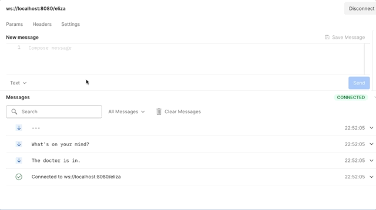

# Lab Assignment Guide 2023-2024

Welcome to the third assignment of the 2023-2024 course.
This guide will walk you through the steps to complete the assignment efficiently.
While this guide is command-line oriented, you are free to use IDEs like **VS Code**, **IntelliJ IDEA**, or **Eclipse**,
which have full support for the tools we are going to use.
Ensure that you have at least **Java 17** installed on your system.

## Getting Started

### Clone the Repository

1. Begin by cloning the assignment repository to your local machine:

    ```bash
    git clone https://github.com/UNIZAR-30246-WebEngineering/lab-4-websocket-<your-github-user>.git
    cd lab-4-websocket-<your-github-user>
    ```

2. Make changes to the files, commit the changes to the history and push the branch up to your repository.

    ```bash
    git push origin main
    ```

### Test the Server

If you wish to test the server locally, utilize the following command:

```bash
./gradlew bootRun
```

## Primary task

- Complete the test of `ElizaServerTest`

## Historical background

The code implements the script DOCTOR of the [ELIZA](https://en.wikipedia.org/wiki/ELIZA) system and provides you a client and server that communicate each other with the WebSocket protocol.
ELIZA is an early example of primitive natural language processing developed by [Joseph Weizenbaum](https://en.wikipedia.org/wiki/Joseph_Weizenbaum) between 1964 and 1966.
ELIZA operated by processing users' responses to scripts, the most famous of which was DOCTOR, a simulation of a [Rogerian psychotherapist](https://en.wikipedia.org/wiki/Person-centered_therapy).
Using almost no information about human thought or emotion, DOCTOR sometimes provided a startlingly human-like interaction.

You can interact with the system using postman at *ws://localhost:8080/eliza*:


*Image created by Jorge Laguna (2021)*

## Steps required

The objective is to complete `ElizaServerTest.kt` by completing the test `onChat`.
The `onChat` test must:

- Send a message from the client to the server that is running a Java implementation of the script DOCTOR.
- Check the client receives a DOCTOR question about your mental health (see examples in `Eliza.kt`).

You must remove `@Ignore` and place 6 lines of code and the requested comments to fulfil the task.
`ElizaServerTest.kt` includes the test `onOpen` that will provide you insights.

## How to submit

Push your code to GitHub.

Your work will pass if:

- `tests.kt` validates that the controller implementation is OK.
- The colour of your CI workflow is green.

## Detekt and Ktlint are watching you

[Detekt](https://detekt.dev/) helps you write cleaner Kotlin code, so you can focus on what matters the most building amazing software.

- By default, the standard rule set without any ignore list is executed on sources files located in `src/main/java`, `src/test/java`, `src/main/kotlin` and `src/test/kotlin`.
- Reports are automatically generated in XML, HTML, text, Markdown, and Sarif format and can be found in `build/reports/detekt/detekt.[xml|html|txt|md|sarif]` respectively.
- The [Ktlint](https://ktlint.github.io/) plugin is enabled. It will automatically format your code (if it can) following the [Kotlin Coding Conventions](https://kotlinlang.org/docs/coding-conventions.html#source-code-organization). If *ktlint* changes the source code, the build will fail.

**Detekt** and **Ktlint** are configured to run before compiling the code.
They can be run by:

```bash
./gradlew detekt
```

It is recommended to run `./gradlew detekt` twice before committing your changes.
