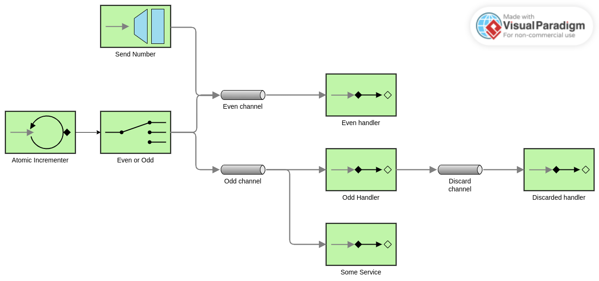

# Web Engineering 2023-2024 / Lab5 Integration and SOA

Please, go to the [GUIDE](docs/GUIDE.md) in order to get the instructions for this assignment.

Some ideas for obtaining a :gift::

- Connect a WebSocket using a bridge
- Store the numbers in a datab ase
- Use complex messages
- Aggregate and split results

# EIP Diagram

- SendNumber will only send to the even channel, even if numbers are odd
- The odd number handler and odd number service can't read the same message since the channel is not published: messages are consumed round-robin
- The filter in the odd number handler is not working: odd numbers are resent to the discard channel
