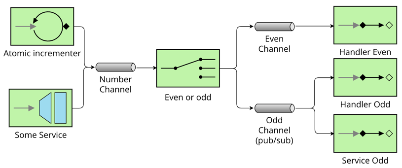

# Lab Assignment Guide 2023-2024

Welcome to the fifth assignment of the 2023-2024 course.
This guide will walk you through the steps to complete the assignment efficiently.
While this guide is command-line oriented, you are free to use IDEs like **VS Code**, **IntelliJ IDEA**, or **Eclipse**,
which have full support for the tools we are going to use.
Ensure that you have at least **Java 17** installed on your system.

## Getting Started

### Clone the Repository

1. Begin by cloning the assignment repository to your local machine:

    ```bash
    git clone https://github.com/UNIZAR-30246-WebEngineering/lab5-soa-<your-github-user>.git
    cd lab5-soa-<your-github-user>
    ```

2. Make changes to the files, commit the changes to the history and push the branch up to your repository.

    ```bash
    git push origin main
    ```

### Test the Application

If you wish to test the server locally, utilize the following command:

```bash
./gradlew bootRun
```

## Primary task

- Create an EIP diagram that describes the current configuration. 
  Use [VisualParadigm Online](https://online.visual-paradigm.com/app/diagrams/#diagram:proj=0&type=EnterpriseIntegrationPattern&width=11&height=8.5&unit=inch)
  or similar. The diagram must be included in the repository. 
- Modify the code to implement the configuration described in the EIP diagram below.





## How to submit

Push your code to GitHub.

Your work will pass if:

- The color of your CI workflow is green.
- The EIP diagram is correct.
- The code is correct.

## Detekt and Ktlint are watching you

[Detekt](https://detekt.dev/) helps you write cleaner Kotlin code, so you can focus on what matters the most building amazing software.
It is configured to run before compiling the code.

- By default, the standard rule set without any ignore list is executed on sources files located in `src/main/java`, `src/test/java`, `src/main/kotlin` and `src/test/kotlin`.
- Reports are automatically generated in xml, html, txt, md, and sarif format and can be found in build/reports/detekt/detekt.[xml|html|txt|md|sarif] respectively.
- Also, the [Ktlint](https://ktlint.github.io/) plugin has been enabled. It will automatically format your code (if it can) respectively to the [Kotlin Coding Conventions](https://kotlinlang.org/docs/coding-conventions.html#source-code-organization). If the source code is changed the build will fail.